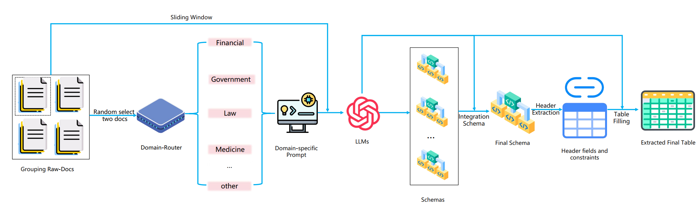

# Docs2Table: Can LLMs Bridge Between Multi-Document and Structured Tables?


This is the official code and data repository for the paper:Docs2Table: Can LLMs Bridge Between Multi-Document and Structured Tables?




## LiveSum Dataset

The FGLM dataset can be found in the ``data/FGLM/`` folder.

## Evaluation

To evaluate the results, you can use the following command:
```shell
python eval/eval_bert_metrics.py 
```
